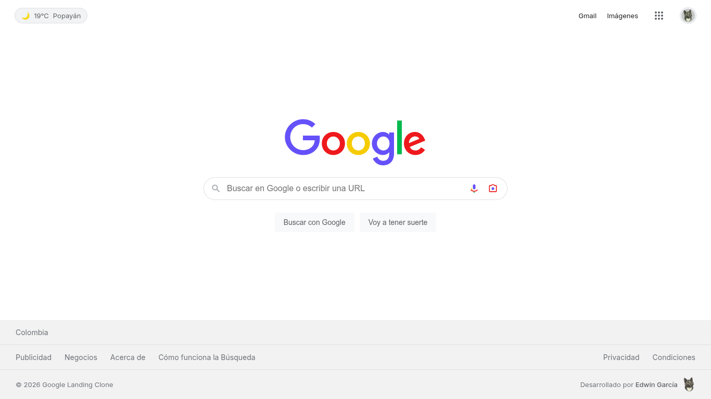

# Google Landing Clone 🌐

Un clon interactivo y altamente fiel de la página de inicio de Google, desarrollado desde cero como ejercicio de maquetación y desarrollo web profesional. El proyecto no solo replica la interfaz visual, sino que incorpora **modo oscuro**, **interactividad con JavaScript vanilla** y una **arquitectura CSS limpia y escalable**.

## 🖼️ Vista Previa del Sitio

<p align="center">
  
</p>

## 🚀 Tecnologías Utilizadas

- **HTML5 Semántico**: Estructura limpia orientada a la accesibilidad y optimización DOM.
- **CSS3 Moderno**: Arquitectura con variables globales (`:root`), Flexbox, CSS Grid, media queries refinadas y `@media (hover: hover)` para optimización táctil/móvil.
- **JavaScript (ES6+)**: Módulos nativos (`ES Modules`), Web Speech API, Geolocation API y consumo de servicios REST.
- **SVG & Assets**: Iconografía vectorial optimizada y gestión eficiente de imágenes.

## ✨ Funcionalidades e Interacciones

- 🌙 **Modo Oscuro Nativo**: Transición fluida de temas adaptada a los colores oficiales de Google.
- 🎛️ **Popovers Interactivos**: Menú desplegable de aplicaciones de Google y tarjeta de perfil de usuario.
- 🔍 **Buscador Dinámico**: Input estilizado con menú desplegable de sugerencias y resaltado de texto.
- 🎙️ **Búsqueda por Voz**: Reconocimiento de voz en tiempo real utilizando la Web Speech API nativa.
- 📷 **Modal Google Lens**: Ventana modal interactiva con zona de arrastrar/soltar (`Drag & Drop`) y soporte para URLs.
- 🌤️ **Widget de Clima Dinámico**: Consulta de clima en tiempo real mediante Open-Meteo y geolocalización del navegador.
- 🎲 **Botón "Voy a tener suerte"**: Interacción y redirección directa simulando el comportamiento nativo.
- 📱 **Diseño 100% Responsive**: Adaptación precisa a dispositivos móviles, tablets y monitores de alta resolución.

## 💡 Aspectos Técnicos Destacados

* **Arquitectura de Variables CSS**: Uso de un sistema de diseño centralizado en `:root` para gestionar colores nativos, sombras, tipografías y tiempos de transición en ambos temas (Claro/Oscuro).
* **Experiencia de Usuario (UX) Refinada**: Control estricto de estados `:hover`, `:focus` y `:active` evitando superposición de efectos.
* **JavaScript Vanilla & Modular**: Implementación ligera basada en ES Modules, sin dependencias ni librerías externas para maximizar el rendimiento.
* **Resiliencia y Manejo de Errores**: Peticiones asíncronas encapsuladas con límite de tiempo (`AbortController`) y fallback automático ante fallos de red.

## 🛠️ Desafíos Técnicos Superados

- **Gestión Avanzada de Enlaces Internos**: Solución al problema de herencia de subrayado en elementos complejos con etiquetas compuestas (`<span>` dentro de `<a>`).
- **Control de Interacciones Táctiles**: Encapsulamiento de efectos `:hover` en consultas `@media (hover: hover)` para evitar comportamientos no deseados en dispositivos móviles.
- **Geolocalización Inversa y Manejo de Red**: Implementación de fallbacks dinámicos cuando la API de ubicación es rechazada o tarda demasiado en responder.

## 📂 Estructura del Proyecto

```text
google-landing-clone/
├── assets/
│   ├── brand/
│   │   ├── avatar.jpeg               # Foto/avatar de perfil
│   │   └── logo.png                  # Logo personal
│   ├── icons/
│   │   └── favicon.ico               # Icono de la pestaña
│   └── img/
│       ├── google-landing-clone.png  # Vista previa para el README
│       └── google-logo.png           # Logo de Google
├── css/
│   └── style.css                     # Estilos principales, variables y responsive
├── js/
│   ├── modules/
│   │   ├── autocomplete.js           # Lógica para sugerencias de búsqueda
│   │   ├── lensModal.js              # Control del modal de Google Lens
│   │   ├── luckySearch.js            # Lógica para el botón "Voy a tener suerte"
│   │   ├── popovers.js               # Manejo de menús desplegables (Apps/Perfil)
│   │   ├── theme.js                  # Alternancia de modo oscuro/claro
│   │   ├── voiceSearch.js            # Búsqueda por voz mediante Web Speech API
│   │   └── weather.js                # Widget de clima y geolocalización
│   └── main.js                       # Punto de entrada de JavaScript
├── index.html                        # Estructura semántica HTML5
├── LICENSE                           # Licencia del proyecto
└── README.md                         # Documentación del proyecto
```

## ⚙️ Instalación y Uso Local

Al hacer uso de **ES Modules** (`import` / `export`), los navegadores requieren que el proyecto se ejecute bajo el protocolo HTTP/HTTPS debido a políticas de seguridad (CORS).

1. **Clona este repositorio:**
  ```bash
    git clone https://github.com/edwingarcia14/google-landing-clone.git

    cd google-landing-clone
  ```

2. **Ejecutar un servidor local** (opciones recomendadas):
  - **VS Code**: Utiliza la extensión [Live Server](https://marketplace.visualstudio.com/items?itemName=ritwickdey.LiveServer).
  - **Node.js**: `npx serve .`
  - **Python**: `python -m http.server 8000`

3. Abre tu navegador e ingresa a `http://localhost:8000` (o el puerto configurado).

## 📝 Licencia

Este proyecto está bajo la Licencia MIT. Consulta el archivo [LICENSE](LICENSE) para más detalles.

---
<p align="center">
  
  <br />
  <sub><b>Desarrollado por Edwin García</b> | 2026</sub>
</p>